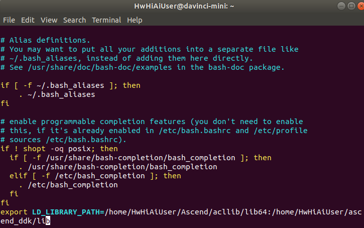

# 安装ffmpeg+opencv

安装ffmpeg和opencv的原因是适配多样性的数据预处理和后处理，昇腾社区的部分样例也是基于ffmpeg和opencv做的处理。如果用户仅需要构建自己的代码，可以不安装ffmpeg+opencv，直接使用自带的dvpp能力。值得一提的是，dvpp在Ascend310芯片中是有硬件方面的加速能力的，处理速度也会更快。

1.  开发板设置联网（root用户密码：Mind@123）。  
    **su root**  
    **vi /etc/netplan/01-netcfg.yaml**   
    填写以下配置。
  
    填写后执行以下命令使配置生效，并将开发板网口接上可正常联网的网线。  
    **netplan apply**   
    重启开发板。  
    **reboot** 

2.  开发板换源（更换ubuntu18.04-arm华为源）。  
    开发板重启完成后，四个灯常亮，此时再登录到开发板上。  
    **ssh HwHiAiUser@192.168.1.2**   
    登录到开发板上之后再执行以下换源操作。  
    **wget -O /etc/apt/sources.list https://repo.huaweicloud.com/repository/conf/Ubuntu-Ports-bionic.list**   
    更新源。  
    **apt-get update** 

3.  安装相关依赖（需要在root用户下安装）。  
    **su root**  
    **apt-get install build-essential libgtk2.0-dev libavcodec-dev libavformat-dev libjpeg-dev libtiff4-dev git cmake libswscale-dev**

4.  安装ffmpeg。  
    先切换回普通用户。  
    **exit**  

    创建文件夹，用于存放编译后的文件。  
    **mkdir /home/HwHiAiUser/ascend_ddk**

    下载ffmpeg。  
    **cd $HOME**  
    **wget http://www.ffmpeg.org/releases/ffmpeg-4.1.3.tar.gz**  
    **tar -zxvf ffmpeg-4.1.3.tar.gz**  
    **cd ffmpeg-4.1.3**

    安装ffmpeg。  
    **./configure --enable-shared --enable-pic --enable-static --disable-yasm --prefix=/home/HwHiAiUser/ascend_ddk**  
    **make -j8**    
    **su root**  
    **make install**

    将ffmpeg添加到系统环境变量中，使得其他程序能够找到ffmpeg环境。  
    **vim /etc/ld.so.conf.d/ffmpeg.conf**  
    在末尾添加一行。  
    **/home/HwHiAiUser/ascend_ddk/lib**  
    使配置生效。  
    **ldconfig**  

    配置profile系统文件。  
    **vim /etc/profile**  
    在末尾添加一行。  
    **export PATH=$PATH:/home/HwHiAiUser/ascend_ddk/bin**  
    使配置文件生效。  
    **source /etc/profile**  
    使opencv能找到ffmpeg。  
    **cp /home/HwHiAiUser/ascend_ddk/lib/pkgconfig/\* /usr/share/pkgconfig**  
    退出root用户。  
    **exit**

5.  安装opencv。  
    下载opencv。  
    **git clone -b 4.3.0 https://github.com/opencv/opencv.git**  
    **cd opencv**  
    **mkdir build**  
    **cd build**  

    安装opencv。  
    **cmake -D BUILD_SHARED_LIBS=ON -D BUILD_TESTS=OFF -D CMAKE_BUILD_TYPE=RELEASE -D             CMAKE_INSTALL_PREFIX=/home/HwHiAiUser/ascend_ddk \.\.**  
    **make -j8**  
    **make install**

6.  修改环境变量。
    程序编译时会链接LD_LIBRARY_PATH环境变量地址中的库文件，所以要将ffmpeg和opencv安装的库文件地址加到该环境变量中。  
    **vi ~/.bashrc**  
    在最后添加  
    **export LD_LIBRARY_PATH=/home/HwHiAiUser/Ascend/acllib/lib64:/home/HwHiAiUser/ascend_ddk/lib**
       
    执行以下命令使环境变量生效。  
    **source ~/.bashrc**

7.  将开发板上安装的ffmpeg和opencv库导入开发环境中，以提供编译使用。  
    以下操作在host侧执行，不在开发板上。   
    使用普通用户执行   
    **scp -r HwHiAiUser@192.168.1.2:/home/HwHiAiUser/ascend_ddk /home/ascend**  
    切换至root用户  
    **su root**  
    **cd /usr/lib/aarch64-linux-gnu**  
    **scp -r HwHiAiUser@192.168.1.2:/lib/aarch64-linux-gnu/\* ./**  
    **scp -r HwHiAiUser@192.168.1.2:/usr/lib/aarch64-linux-gnu/\* ./**