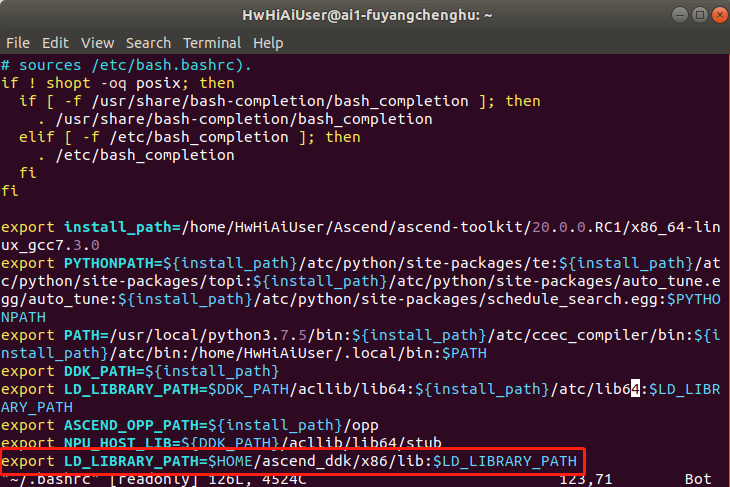

# 安装ffmpeg+opencv

**注：运行环境可以存在多种架构（如arm架构下的Centos系统、arm架构下的Euleros系统、x86架构下的Ubuntu系统等），本指导中只以ai1环境（x86架构下的Ubuntu系统）为例说明**

对于Atlas300的ai1环境来说，第三方库可以在开发环境（Mindstudio所在的本地虚拟机环境）中直接安装，安装后，将相应的SO拷贝到云端环境，再登录云端环境增加一个环境变量即可。

以下云端环境ip以122.57.255.31（此环境不存在）为例说明。  

1.  安装相关依赖。  
    在开发环境命令行中以普通用户执行以下命令，安装ffmpeg+opencv所需要的第三方依赖。  
    **sudo apt-get install build-essential libgtk2.0-dev libavcodec-dev libavformat-dev libjpeg-dev libtiff5-dev git cmake libswscale-dev**

2.  安装ffmpeg。  
    1. 创建文件夹，用于存放编译后的文件。  
        **mkdir -p /home/HwHiAiUser/ascend_ddk/x86**

    2. 下载ffmpeg。  
        **cd $HOME**  
        **wget http://www.ffmpeg.org/releases/ffmpeg-4.1.3.tar.gz**  
        **tar -zxvf ffmpeg-4.1.3.tar.gz**  
        **cd ffmpeg-4.1.3**

    3. 安装ffmpeg。  
        **./configure --enable-shared --enable-pic --enable-static --disable-yasm --prefix=/home/HwHiAiUser/ascend_ddk/x86**  
        **make -j8**    
        **make install**

    4. 将ffmpeg添加到系统环境变量中，使得其他程序能够找到ffmpeg环境。  
        切换为root用户。  
        **su root**  
        打开conf配置文件。
        **vim /etc/ld.so.conf.d/ffmpeg.conf**  
        在末尾添加一行。  
        **/home/HwHiAiUser/ascend_ddk/x86/lib**  
        使配置生效。  
        **ldconfig**   

    5. 配置profile系统文件。  
        **vim /etc/profile**  
        在末尾添加一行。  
        **export PATH=$PATH:/home/HwHiAiUser/ascend_ddk/x86/bin**  
        使配置文件生效。  
        **source /etc/profile**  
    
    6. 使opencv能找到ffmpeg。  
        **cp /home/HwHiAiUser/ascend_ddk/x86/lib/pkgconfig/\* /usr/share/pkgconfig**  
       切换回普通用户。  
        **exit**

3.  安装opencv。  
    1.  下载opencv。  
        **git clone -b 4.3.0 https://gitee.com/mirrors/opencv.git**  
        **cd opencv**  
        **mkdir build**  
        **cd build**  

    2.  安装opencv。  
        **cmake -D BUILD_SHARED_LIBS=ON -D BUILD_TESTS=OFF -D CMAKE_BUILD_TYPE=RELEASE -D             CMAKE_INSTALL_PREFIX=/home/HwHiAiUser/ascend_ddk/x86 \.\.**  
        **make -j8**  
        **make install**  

    3.  配置opencv。  
        更新系统库  
        **sudo ldconfig**  
    
4.  将so上传到ai1环境。  
    **cd $HOME**  
    **scp -r ascend_ddk/ HwHiAiUser\@122.57.255.31:/home/HwHiAiUser**

5.  运行环境修改环境变量。
    程序编译时会链接LD_LIBRARY_PATH环境变量地址中的库文件，所以要将ffmpeg和opencv安装的库文件地址加到ai1环境的该环境变量中。  
    
    执行以下命令，在开发环境中登录ai1环境。  
    **ssh HwHiAiUser\@122.57.255.31**  
    登陆后执行以下命令，使用本地的bash环境。  
    **bash** 
   
    打开配置文件。  
    **vi ~/.bashrc**  
    在在最后添加  
    **export LD_LIBRARY_PATH=\\$HOME/ascend_ddk/x86/lib\:\\$LD_LIBRARY_PATH**
       
    
    执行以下命令使环境变量生效。  
    **source ~/.bashrc**