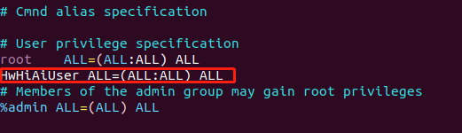

# 安装Python3.7.5运行环境<a name="ZH-CN_TOPIC_0228768065"></a>
以下操作在开发者板上执行。
1.  给用户权限配置  
     **su root**   
    给sudoer文件配置写权限，并打开该文件。    
     **chmod u+w /etc/sudoers**   
     **vi /etc/sudoers**   
    在该文件“ # User privilege specification”下面增加如下内容：  
     **HwHiAiUser ALL=(ALL:ALL) ALL**
 
    

2.  开发板设置联网（root用户密码：Mind@123）。     
    **vi /etc/netplan/01-netcfg.yaml**   
    填写以下配置。      
     **注：需要注意这里的缩进格式，netplan配置时和python类似，对缩进有强限制** 

    ```
    network:
      version: 2
    #  renderer: NetworkManager
      renderer: networkd
      ethernets:
        eth0:
          dhcp4: yes 
   
        usb0:
          dhcp4: no 
          addresses: [192.168.1.2/24] 
          gateway4: 192.168.0.1
    ```


      


    填写后执行以下命令使配置生效，并将开发板网口接上可正常联网的网线。  
    **netplan apply**   
    **exit**  

3.  开发板换源（更换ubuntu18.04-arm华为源）。  
    执行以下换源操作。  
    **sudo wget -O /etc/apt/sources.list https://repo.huaweicloud.com/repository/conf/Ubuntu-Ports-bionic.list**   
    更新源。  
    **sudo apt-get update**   

4.  安装python依赖以及gcc等软件  
     **sudo apt-get install -y gcc make cmake unzip zlib1g zlib1g-dev libsqlite3-dev openssl libssl-dev libffi-dev 
pciutils net-tools**   

5.  安装Python3.7.5  
     **wget https://www.python.org/ftp/python/3.7.5/Python-3.7.5.tgz**     
     **tar -zxvf Python-3.7.5.tgz**     
     **cd Python-3.7.5**   
     **./configure --prefix=/usr/local/python3.7.5 --enable-shared**   
     **make -j8**   
     **sudo make install**   
     **sudo cp /usr/local/python3.7.5/lib/libpython3.7m.so.1.0 /usr/lib64**   
     **sudo cp /usr/local/python3.7.5/lib/libpython3.7m.so.1.0 /usr/lib**  
    当出现如下显示，则输入y，表示覆盖系统自带的libpython3.7m.so.1.0文件。  
    cp: overwrite 'libpython3.7m.so.1.0'?y    
   
    执行如下命令设置软链接：  
    **sudo ln -s /usr/local/python3.7.5/bin/python3 /usr/bin/python3.7  
    sudo ln -s /usr/local/python3.7.5/bin/pip3 /usr/bin/pip3.7  
    sudo ln -s /usr/local/python3.7.5/bin/python3 /usr/bin/python3.7.5  
    sudo ln -s /usr/local/python3.7.5/bin/pip3 /usr/bin/pip3.7.5**   

    执行上述软链接时如果提示链接已经存在，则可以先执行如下命令删除原有链接然后重新执行。  
     **sudo rm -rf /usr/bin/python3.7.5  
    sudo rm -rf /usr/bin/pip3.7.5  
    sudo rm -rf /usr/bin/python3.7  
    sudo rm -rf /usr/bin/pip3.7** 
    
6.  安装 numpy、pillow  
    **pip3.7.5 install numpy --user**   
    **sudo apt-get -y install libjpeg-dev zlib1g-dev**   
    **pip3.7.5 install pillow --user**