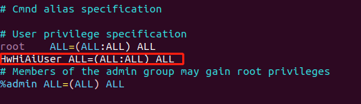

# 安装Python3运行环境<a name="ZH-CN_TOPIC_0228768065"></a>
以下操作在开发者板上执行。
1.  给用户权限配置  
     **su root**   
    给sudoer文件配置写权限，并打开该文件。    
     **chmod u+w /etc/sudoers**   
     **vi /etc/sudoers**   
    在该文件“ # User privilege specification”下面增加如下内容：  
     **HwHiAiUser ALL=(ALL:ALL) ALL**
 
    

2.  开发板设置联网（root用户密码：Mind@123）。     
    **vi /etc/netplan/01-netcfg.yaml**   
    填写以下配置。      
     **注：需要注意这里的缩进格式，netplan配置时和python类似，对缩进有强限制** 

    ```
    network:
      version: 2
    #  renderer: NetworkManager
      renderer: networkd
      ethernets:
        eth0:
          dhcp4: yes 
   
        usb0:
          dhcp4: no 
          addresses: [192.168.1.2/24] 
          gateway4: 192.168.0.1
    ```


      


    填写后执行以下命令使配置生效，并将开发板网口接上可正常联网的网线。  
    **netplan apply**   
    **exit**  

3.  开发板换源（选，国外用户可不用更换，使用默认源）。  
    执行以下命令更换为ubuntu18.04-arm华为源。  
    **sudo wget -O /etc/apt/sources.list https://repo.huaweicloud.com/repository/conf/Ubuntu-Ports-bionic.list**   
    更新源。  
    **sudo apt-get update**   

    
4.  安装 numpy、pillow  
    **sudo apt-get install libtiff5-dev libjpeg8-dev zlib1g-dev libfreetype6-dev liblcms2-dev libwebp-dev tcl8.6-dev tk8.6-dev python-tk**  
 
    **pip3 install pillow --user**  
    **pip3 install numpy --user** 